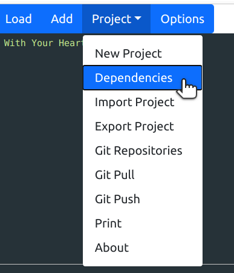
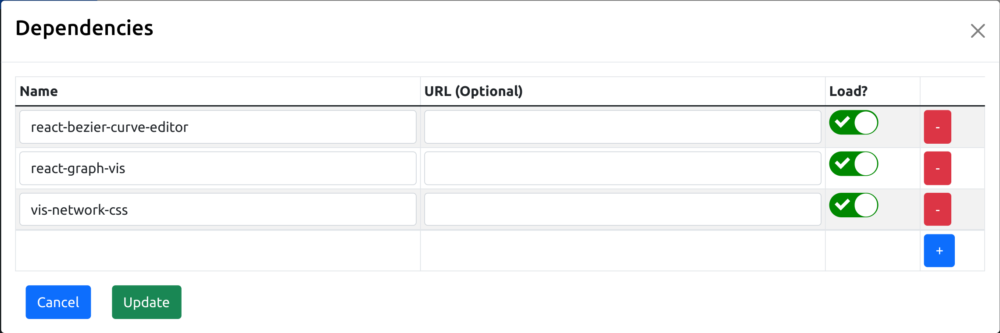

<!-- more -->

# Adding a Dependency

## Finding Dependencies

## Linking in Code

## The Default Plan

# Round Two: Bulding New Dependencies

## Custom Dependencies

Some text:

More Text:

And More:
